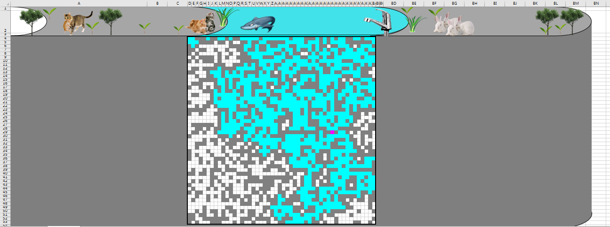

# 這是模擬雨水滲透至土壤，並計算切斷孔隙率的的VBA實作
請打開excel >> 點選開發人員 >> 點選Visual Basic >> 觀看程式碼與工作表上結果呈現

---

### 題目要求：
土穰原本皆為實心，隨機挖洞，計算求挖到多少比例的洞(孔隙)時，雨水可以滲透至土壤最底層。  
切斷孔隙率 = 挖洞數 / 土壤總格子數  

### 模擬策略前提：  
1. 滲透方向為由上到下  
2. 用 *隨機拔格子概念* 來移 *除格子點* (初始皆為灰色，拔掉後變成無顏色)  
3. 每次隨機拔格子皆為1/2500的機率  
> x = Int(RndX * 2500) + 1) 
4. 用If判斷來解決拔到重覆的格子問題
> If pos(x + 53 + (Int((x - 1) / 50)) * 2).Interior.ColorIndex = 16 
> Then……，  
    即若拔到的格子是原始的灰色，才往下執行，否則直接跳出，拔下個格子)  
5. 判斷流通的方式為：每做完一組全部的stack後，使變數 water = 0 後，用 For 迴圈包 If 判斷，最底下那排  
    之中，只要有任何一格有染到水，就讓 water = 1，跳出迴圈後，最外層的 Do Loop 就 Loop until water = 1 即代表已流通。  
6. 判斷最後一個拔的格子點的方式：在判定最底下那排完後，如果 water = 1，就使  
> pos(x + 53 + (Int((x - 1) / 50)) * 2) .Interior.ColorIndex = 7
(因為還未離開Do loop迴圈，那次的x值沒變)。  
  

### 模擬策略重點：  
1. 定義一變數 pos 為 Range， 
> Set pos = Range(“C3:BB54”)

2. 直接用Range的儲存格顏色判斷。  
> pos.Cells(i).Interior.ColorIndex
3. 把50x50的二維格子，一維化處理，且使用自創公式
> x + 53 + (Int((x - 1) / 50)) * 2)  
將1/2500隨機選到的格子，轉成52x52的range中的中央50x50部分。  
4. 使用stack陣列來記錄需要被染水但未染的格子。(stack判斷邏輯在下面詳述。)  
  
#### Stack 資料結構判斷邏輯：  
	我的stack陣列使用時機，是在確定挖了一個新的洞，且新洞上下左右四周至少有一邊有水時，  
	開始進入stack程序。初始使 j = 1 ，j 是stack( )陣列的序數，將新挖的洞染水後，  
	先用四組If判斷新洞四周，若也是洞就 j = j + 1 並將四周的洞暫時存入stack( )陣列中，後進先出，  
	將洞都存完後才開始執行第 j 個stack( j )。  
  
	執行stack( j )陣列時，我使用If 包一個Do Loop迴圈，If j > 1(新洞四周至少有一邊也是洞)時才用Do loop迴圈執行Stack。  
	執行時先把第 j 個洞染水(後進先出)，且將第 j 個洞的位置(stack( j ))暫存入變數stacking，  
	存完使 j = j – 1(讓下一個存入的stack可以維持在第 j 個，因為執行stack迴圈時永遠是執行第j個)後，  
	才開始判斷「新洞的四周  的四周」是否也有洞，有的話一樣使 j = j + 1並四周的洞也暫時存入stack( )陣列中，  
	存完後再去執行下個(第 j 個)洞，Loop直到 j =1為止  
	( j 回復到初始值1時，表示所有stack陣列中暫存需要被染水的洞都已經執行完畢了)，才完成一輪。  
  

以下為程式碼：

```VBA
Option Explicit
Sub 五十乘五十stack10轉12版()

ActiveSheet.Cells.Clear
        
Dim water%, x%, i%, j%, stacking%, a%, hole%, k As Integer
Dim n1!, n2!, n3 As Single
Dim stack(1 To 2500) As Single
Dim stTimer As Single
Dim pos As Range
RandomizeX
'Range("C3:N14").Interior.ColorIndex = 16
'Range("D3:M3").Interior.ColorIndex = 28

ActiveSheet.Cells(2, "BD") = "模擬序數"
ActiveSheet.Cells(2, "BE") = "移除格子點數"
ActiveSheet.Cells(2, "BF") = "切斷孔隙率"
ActiveSheet.Cells(2, "BG") = "跑程式時間"


Set pos = Range("C3:BB54")

'For a = 1 To 2500
'stack(a) = 0
'Next

Range("D4:BA53").Select
    Selection.Borders(xlDiagonalDown).LineStyle = xlNone
    Selection.Borders(xlDiagonalUp).LineStyle = xlNone
    With Selection.Borders(xlEdgeLeft)
        .LineStyle = xlContinuous
        .ColorIndex = 0
        .TintAndShade = 0
        .Weight = xlMedium
    End With
    With Selection.Borders(xlEdgeTop)
        .LineStyle = xlContinuous
        .ColorIndex = 0
        .TintAndShade = 0
        .Weight = xlMedium
    End With
    With Selection.Borders(xlEdgeBottom)
        .LineStyle = xlContinuous
        .ColorIndex = 0
        .TintAndShade = 0
        .Weight = xlMedium
    End With
    With Selection.Borders(xlEdgeRight)
        .LineStyle = xlContinuous
        .ColorIndex = 0
        .TintAndShade = 0
        .Weight = xlMedium
    End With
    Selection.Borders(xlInsideVertical).LineStyle = xlNone
    Selection.Borders(xlInsideHorizontal).LineStyle = xlNone
    
'----------前置完成------------------------------------------------------

For k = 1 To 100

stTimer = Timer

    pos.Cells().Interior.ColorIndex = 16
    For i = 2 To 51
    pos.Cells(i).Interior.ColorIndex = 28
    Next
    
    Do  '先暫時用for迴圈代替
    'For a = 1 To 100
        
        '挖洞
        x = Int(RndX * 2500) + 1
        If pos(x + 53 + (Int((x - 1) / 50)) * 2).Interior.ColorIndex = 16 Then
            pos(x + 53 + (Int((x - 1) / 50)) * 2).Interior.ColorIndex = xlNone '10x10的個數"x"，加上最上排n+2個、次排第一個(共n+3個)，再加int(x/n)*2個
                   
            '挖完洞，判斷流水染色，如果四周(左右+1/上下+(n+2))有水，才做
            If pos(x + 53 + (Int((x - 1) / 50)) * 2 + 1).Interior.ColorIndex = 28 Or pos(x + 53 + (Int((x - 1) / 50)) * 2 - 1).Interior.ColorIndex = 28 _
            Or pos(x + 53 + (Int((x - 1) / 50)) * 2 + 52).Interior.ColorIndex = 28 Or pos(x + 53 + (Int((x - 1) / 50)) * 2 - 52).Interior.ColorIndex = 28 Then
        
                '每染到一個新白格時，先記錄新白格周圍能繼續染的白格到stack中暫存
                Do
                
                j = 1
                pos(x + 53 + (Int((x - 1) / 50)) * 2).Interior.ColorIndex = 28   '新挖的洞本身先染水
                
                '左
                If pos(x + 53 + (Int((x - 1) / 50)) * 2 - 1).Interior.ColorIndex = xlNone Then
                j = j + 1
                stack(j) = x + 53 + (Int((x - 1) / 50)) * 2 - 1
                End If
                
                '右
                If pos(x + 53 + (Int((x - 1) / 50)) * 2 + 1).Interior.ColorIndex = xlNone Then
                j = j + 1
                stack(j) = x + 53 + (Int((x - 1) / 50)) * 2 + 1
                End If
                
                '上
                If pos(x + 53 + (Int((x - 1) / 50)) * 2 - 52).Interior.ColorIndex = xlNone Then
                j = j + 1
                stack(j) = x + 53 + (Int((x - 1) / 50)) * 2 - 52
                End If
                
                '下
                If pos(x + 53 + (Int((x - 1) / 50)) * 2 + 52).Interior.ColorIndex = xlNone Then
                j = j + 1
                stack(j) = x + 53 + (Int((x - 1) / 50)) * 2 + 52
                End If
                
                    '執行暫存中的stack(一個一個 j 依序執行)，後進先出
                    If j > 1 Then
                        Do
                            pos(stack(j)).Interior.ColorIndex = 28  '把下一個洞染水
                            stacking = stack(j)                     '存出新洞位置暫存到stacking(以免stack(j)撞到)
                            j = j - 1   '染完且存完新洞之後j=j-1
                            
                            '先存入stack
                            '左
                            If pos(stacking - 1).Interior.ColorIndex = xlNone Then
                            j = j + 1
                            stack(j) = stacking - 1
                            End If
                    
                            '右
                            If pos(stacking + 1).Interior.ColorIndex = xlNone Then
                            j = j + 1
                            stack(j) = stacking + 1
                            End If
                    
                            '上
                            If pos(stacking - 52).Interior.ColorIndex = xlNone Then
                            j = j + 1
                            stack(j) = stacking - 52
                            End If
                    
                            '下
                            If pos(stacking + 52).Interior.ColorIndex = xlNone Then
                            j = j + 1
                            stack(j) = stacking + 52
                            End If
                            
                            '做完其中一個方向(固定左右下上的順序)再回stack(j)做下一條路，做到
                        Loop Until j = 1
                    End If
                                
                Loop Until j = 1
        
            End If
            
        
                'stack全部流完，還沒碰到底，才做下一輪
                
                water = 0
                For i = 2602 To 2651
                    If pos(i).Interior.ColorIndex = 28 Then   'pos(122~131)其中任一通水就結束   n*(n-2)+2 ~ n*(n-1)-1
                    water = 1
                    End If
                Next
            
                If water = 1 Then
                    pos(x + 53 + (Int((x - 1) / 50)) * 2).Interior.ColorIndex = 7
                End If
            
        End If
    
    'Next
    Loop Until water = 1
    
    hole = 0
    
    For i = 1 To 2704
        If pos(i).Interior.ColorIndex = xlNone Or pos(i).Interior.ColorIndex = 28 Then
        hole = hole + 1
        End If
    Next

    ActiveSheet.Cells(2 + k, "BD") = k
    ActiveSheet.Cells(2 + k, "BE") = hole
    ActiveSheet.Cells(2 + k, "BF") = hole / 2500
    ActiveSheet.Cells(2 + k, "BG") = Timer - stTimer

Next

n1 = 0
n2 = 0
n3 = 0

For i = 1 To 100
n1 = n1 + ActiveSheet.Cells(2 + i, "BE").Value
n2 = n2 + ActiveSheet.Cells(2 + i, "BF").Value
n3 = n3 + ActiveSheet.Cells(2 + i, "BG").Value
Next

ActiveSheet.Cells(103, "BC") = "平均"
ActiveSheet.Cells(103, "BE") = n1 / 100
ActiveSheet.Cells(103, "BF") = n2 / 100
ActiveSheet.Cells(103, "BG") = n3 / 100

' 調整格式 巨集
    Range("BE103").Select
    Selection.NumberFormatLocal = "0_ "
    ActiveWindow.SmallScroll Down:=-102
    Range("BF3").Select
    Range(Selection, Selection.End(xlDown)).Select
    Selection.NumberFormatLocal = "0.00%"
    ActiveWindow.SmallScroll Down:=48

```

100次平均結果：  
> 切斷孔隙率：61.17%  
> 跑程式時間：1.56秒  

另有上台報告的版本(視覺化，把水龍頭設成巨集觸發，按下即可重跑一次隨機切孔，並計算切斷孔隙率)：  

  


